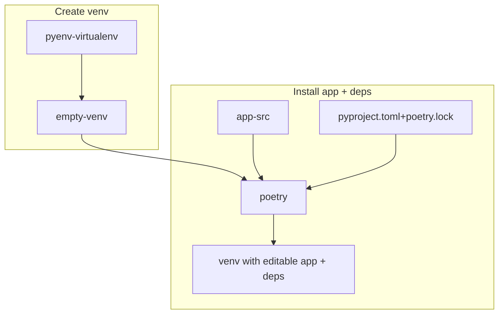
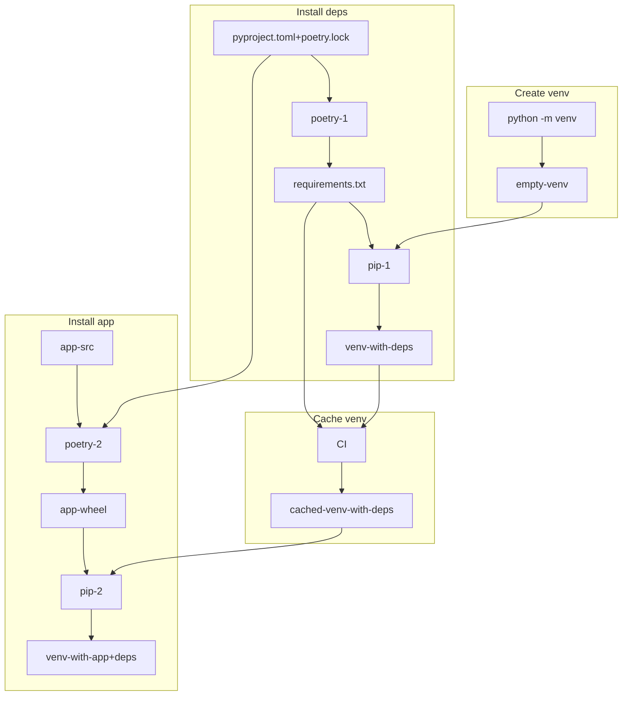
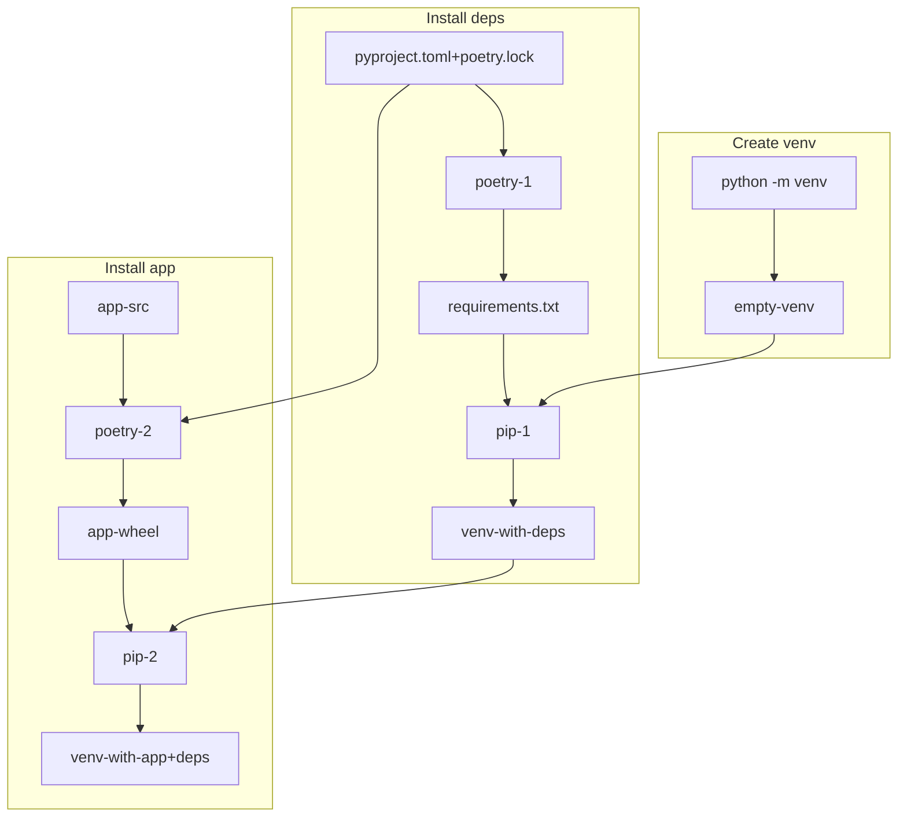

## Dev

```mermaid
graph TD
    subgraph Create venv
        pyenv-virtualenv --> empty-venv
    end
    subgraph Install app + deps
        empty-venv & app-src & pyproject.toml+poetry.lock --> poetry --> 1[venv with editable app + deps]
    end
```

## CI

```mermaid
graph TD
    subgraph Create venv
        1[python -m venv] --> empty-venv
    end
    subgraph Install deps
        pyproject.toml+poetry.lock --> poetry-1 --> requirements.txt
        requirements.txt & empty-venv --> pip-1 --> venv-with-deps
    end
    subgraph Cache venv
        requirements.txt & venv-with-deps --> CI --> cached-venv-with-deps
    end
    subgraph Install app
        app-src & pyproject.toml+poetry.lock --> poetry-2 --> app-wheel
        app-wheel & cached-venv-with-deps --> pip-2 --> venv-with-app+deps
    end
```

## Prod / Staging / etc

```mermaid
graph TD
    subgraph Create venv
        1[python -m venv] --> empty-venv
    end
    subgraph Install deps
        pyproject.toml+poetry.lock --> poetry-1 --> requirements.txt
        requirements.txt & empty-venv --> pip-1 --> venv-with-deps
    end
    subgraph Install app
        app-src & pyproject.toml+poetry.lock --> poetry-2 --> app-wheel
        app-wheel & venv-with-deps --> pip-2 --> venv-with-app+deps
    end
```
